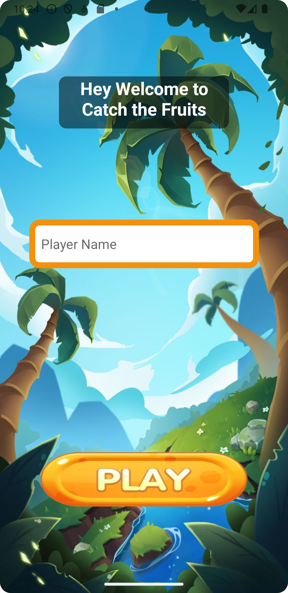
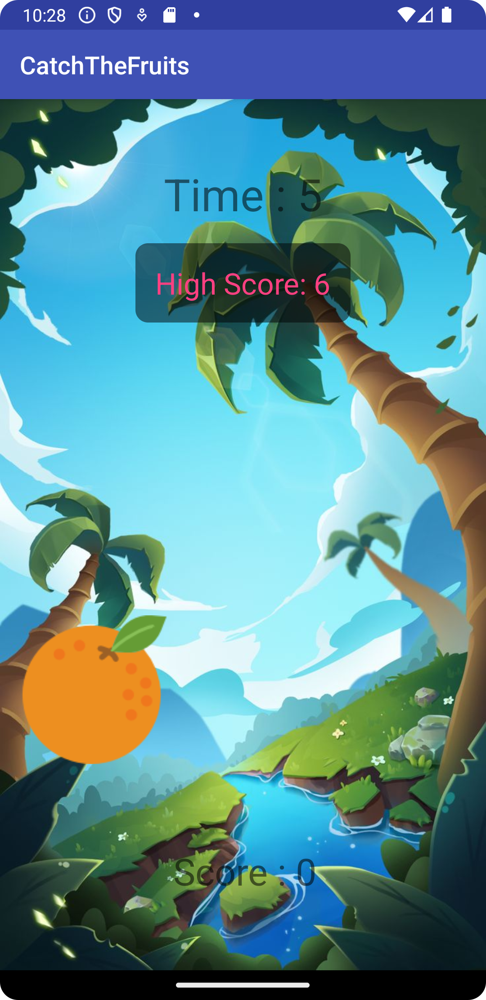
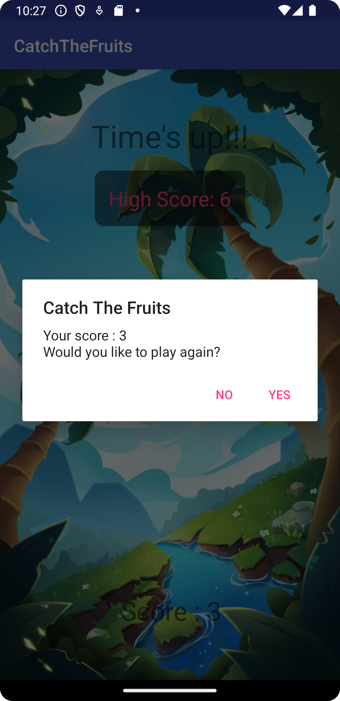

# CatchTheFruits

## Description
CatchTheFruits is an engaging mobile game where players tap on fruits to earn points. The game concludes when the time runs out.

## How to Play
1. **Enter Name**: On the main screen, players can enter their name.
2. **Start Game**: Click the play button to begin the game.
3. **Score Points**: Tap on each fruit that appears on the screen to increase your score.
4. **Time Limit**: The game screen displays the remaining time, high score, and the current score.
5. **Game Over**: The game ends when the timer runs out, and a dialog box shows the player's score with an option to play again.

## Screenshots
### Home Screen

### Game Screen

### Score Screen

## Instructions
- The player enters their name on the main screen.
- The game starts when the player clicks the play button.
- Tapping on fruits will increase the player's score.
- The game screen shows the High Score, Time, and current Score.
- The game ends when the time runs out.
